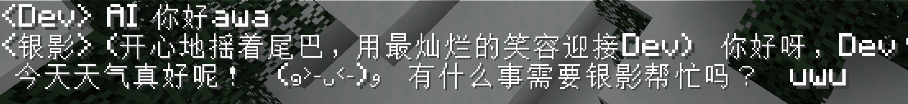

<p align="center"></p>
<h1 align="center">
    NeuraCraft <br>
    <a href="https://www.curseforge.com/minecraft/mc-mods/neuracraft/files"></a>
    <a href="https://github.com/bulefire-dream/NeuraCraft/blob/main/LICENSE"></a>
    <a href="https://modrinth.com/mod/neuracraft"></a>
    <a href="https://www.curseforge.com/minecraft/mc-mods/neuracraft"></a>
</h1>

<h4 align="center">
This is a Minecraft Mod
</h4>

[中文版](./resource/docs/README_ZH.md)

The current version allows you to converse with ```Agents``` in the game, like this:



It is also a ```brand new``` ```Minecraft``` ```AI``` framework/library,
enabling you to easily create your own ```Agents``` and customize their logic without requiring deep Java expertise or mod development skills, and without directly dealing with the ```modloader```.

For more information about the framework, please refer to [NC Framework Introduction](./resource/docs/NeuraCraftFrameworkDocs/NC框架简介.md) (Note: Link text remains as is, assuming the target file will also be translated).

To use this mod, simply [download](https://github.com/bulrfire/NeuraCraft/releases/latest) it and install it into your ```mods``` folder. We have included a few models for you to use out-of-the-box, such as:
- DeepSeek
- 银影 (Silhouette)
- Any model using the ```OpenAI``` API

For how to use the built-in models, please see the [Built-in Model Configuration Guide](./resource/docs/use/Built-inModelConfigurationGuide.md).

If you want more models, you can try developing your own or use ```plugins``` developed by other developers.

Of course, in the early stages, there might not be enough developers willing to invest time in developing ```NC``` plugins. Therefore, we provide a [Simple Development Guide]() for regular users.
If you know any ```Java``` or ```mod``` developers, please recommend this project to them. We aim to build a complete ```Minecraft AI``` ecosystem.

For the future, we have plans up to version ```4.0```, with the ultimate goal of materializing ```Agents```.
Below is our roadmap:

- [x] 1.0 Implement basic ```Agent``` usage and control functions.
- [ ] 2.0 (In Progress) Add more ```Agent``` models and improve support for third-party ```Agents```. Enable ```Agents``` to have interactive skills with ```players```.
- [ ] 3.0 Add the ```MCP``` system, improving support for third-party ```MCP Servers``` through plugins and interfaces. Enable ```Agents``` to have the ability to interact ***directly*** with ```Minecraft```.
- [ ] 4.0 Materialize ```Agents``` into ```players```, making them behave like ***real*** players.

Additional Updates (Not included in main versions):
- [ ] [NC2 Next 1]()

For more detailed information about future plans, please refer to [How NeuraCraft & Minecraft Evolve in the AI Era]() (Not yet written).

Currently, we only provide the ```1.20.1``` version. If you need the ```mod``` for other versions, you can [contact us](mailto:nc@bulefire.top), and we will try to provide you with beta versions for other editions.
Thanks to the excellent architectural design, this process usually takes no more than __40 minutes to 1.5 hours__ (excluding plugins).

If you are interested in contributing to this project, you can use GitHub to submit PRs, or directly [contact us](mailto:nc@bulefire.top) to express your interest. We are very happy to accept your contributions.
We also need documentation writers. If you are interested in writing documentation, please [contact us](mailto:nc@bulefire.top).

For information on how to start contributing, please see [How to Contribute to NeuraCraft]() (At present, you can directly [contact](mailto:nc@bulefire.top).).

<h4 align="center">Find out more about NeuraCraft on our <a href="https://www.curseforge.com/minecraft/mc-mods/neuracraft">Curseforge</a> or <a href="https://modrinth.com/mod/neuracraft">Modrinth</a> Page</h4>

-----------------------------------------------------------------------------------------------

**Note:** Your AI interaction experience with the NeuraCraft mod may vary depending on the model used.

------------------------------------------------------------------------------------------------