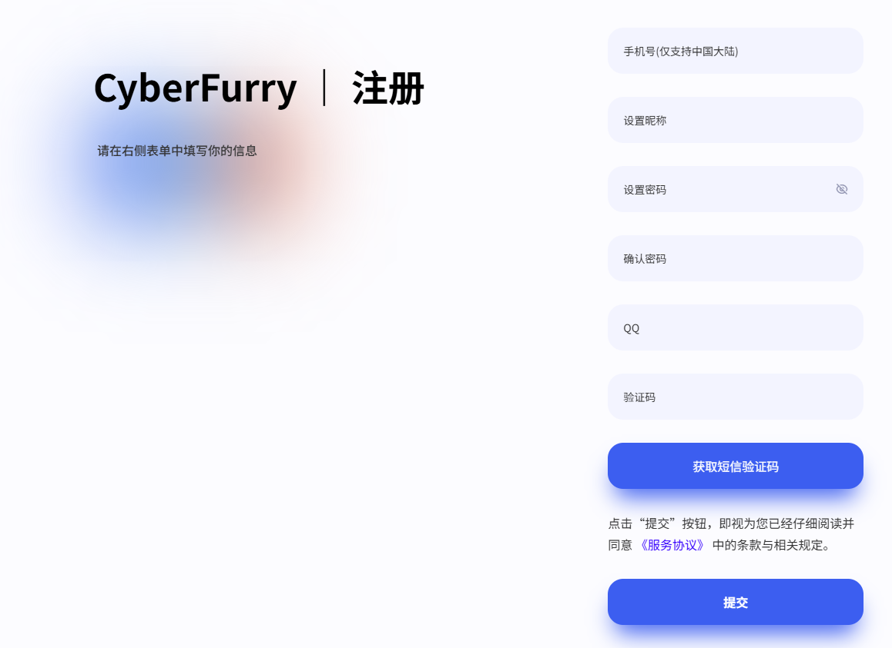
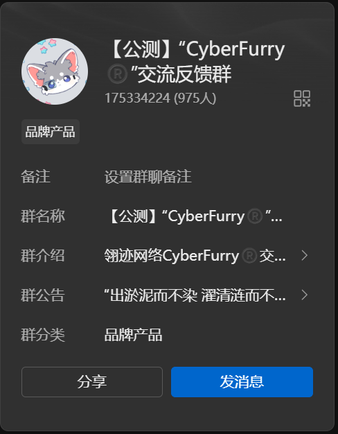
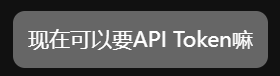
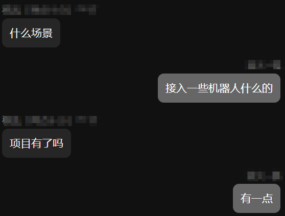
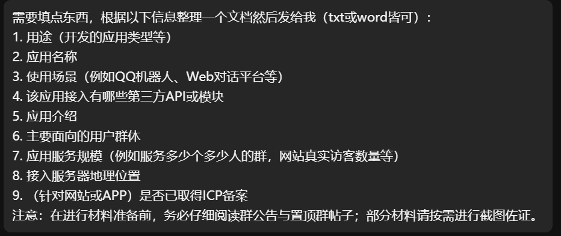
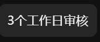
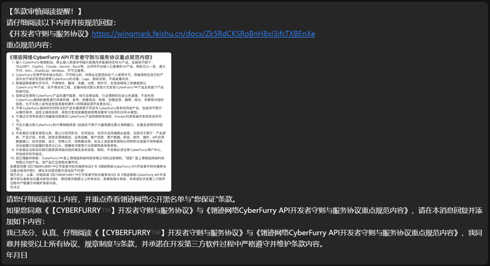
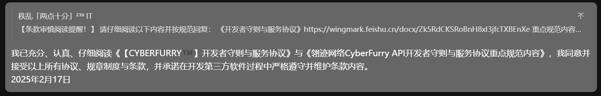
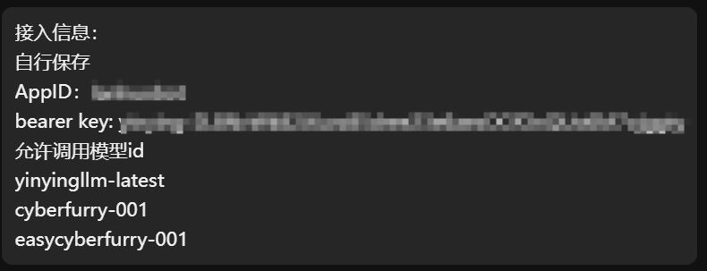

# 开始使用 NeuraCraft for CyberFurry API
## 如何获取 token 和 appid
此mod的```银影```模型由 [CyberFurry](https://chat.wingmark.cn/) 提供,你可以尝试在网页上先尝试与```银影```进行对话,
如要获取模型的 token 和 appid 则需要像 [CyberFurry](https://chat.wingmark.cn/) 申请. <br>
具体流程可以参考下面的叙述,如果你不像申请官方的api,也可以使用我们提供的转发api,具体参阅
<button onclick="location.href='#forward_api';">使用我们提供的转发接口</button>

### 1.注册账号
访问[注册页面](https://chat.wingmark.cn/?page=register)填写信息并注册. 注意需要QQ号,没有的请自行寻找办法注册

[](https://chat.wingmark.cn/?page=register)

### 2.验证账号
访问[qq交流群](https://qm.qq.com/q/cxLuILvN3G)并加入群聊,确保加群qq号和注册qq号一致.并耐心等待管理员审核.
如等不及可以尝试联系管理员加速验证

[](https://qm.qq.com/q/cxLuILvN3G)

### 3.申请 ```token``` 和 ```appid```
联系群主 ```秩乱``` 并发送类似于 ```申请api token之类的字眼```

[](https://chat.wingmark.cn/?page=apply)

如果询问类似于 ```使用场景``` 或者 ```项目规模``` 之类的问题, 可以回答接入 ```机器人``` , ```已经有项目``` 之类的回答.



接下来需要填写一些信息


参考填写

```text
需要填点东西，根据以下信息整理一个文档然后发给我（txt或word皆可）：
1. 游戏内聊天机器人
2. NeuraCraft 用户
3. 游戏内机器人
4. 无
5. 将ai添加到游戏内,给用户更沉浸的游戏体验
6. mc 玩家
7. //这条看服务器情况自行填写
8. //这条看服务器情况自行填写
9. 没有网站或app
```

然后等待审核



接下来仔细阅读协议和开发者须知并回复




随后就会得到 ```token``` 和 ```appid```



将 ```AppID``` 和 ```bearer key``` 填入 ```neuracraft-common.toml``` 文件中即可正常使用

<a id="forward_api"></a>
## 使用我们提供的转发接口
如果您想使用我们提供的转发接口,您目前只需要将配置文件中的 ```apiUrl``` 的值替换为 ```https://neuracraft.bulefire.top:39132/v1```
```toml
    #API URL
    apiUrl = "https://neuracraft.bulefire.top:39132/v1"
```
其他选项不用变更.  
需要注意的是我们的转发服务**目前**并不需要```token```和```appId```,但是我们计划在未来的某个版本加入独立的验证措施以区分用户.
