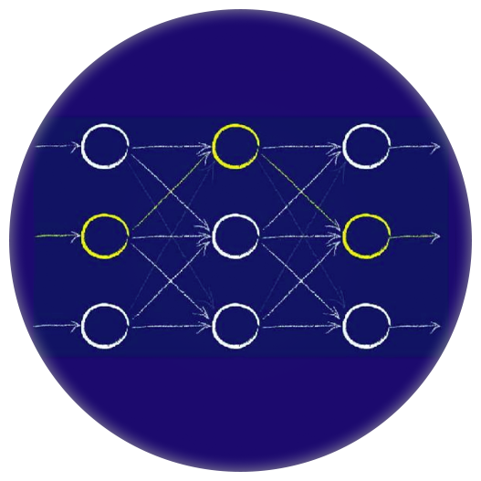

<p align="center"></p>
<h1 align="center">
    NeuraCraft <br>
    <a href="https://www.curseforge.com/minecraft/mc-mods/neuracraft/files"></a>
    <a href="https://github.com/bulefire-dream/NeuraCraft/blob/main/LICENSE"></a>
    <a href="https://modrinth.com/mod/neuracraft"></a>
    <a href="https://www.curseforge.com/minecraft/mc-mods/neuracraft"></a>
</h1>
<h4 align="center">
这是一个 Minecraft 模组
</h4>

当前版本它允许你在游戏中与 ```Agent``` 对话, 就像这样:


同时他还是一个 ```全新的``` ```minecraft``` ```AI``` 框架/库，
他允许你轻松的创建自己的 ```Agent``` 并自定义逻辑而不需要任何高深的Java技巧和模组开发技能, 也无需直面 ```modloader ```。

更多关于框架的介绍请参阅 [NC框架简介](./resource/docs/NeuraCraftFrameworkDocs/NC框架简介.md)

要使用此模组你只需要将其[下载](https://github.com/bulrfire/NeuraCraft/releases/latest)并安装至 ```mods``` 文件夹即可。我们内置了少数模型供你开箱即用例如:
- DeepSeek
- 银影
- 任何使用 ```OpenAI``` 接口的模型

如何使用内置模型请参阅[内置模型配置指南](./resource/docs/use/内置模型配置指南.md)。

如果想要更多的模型可以尝试自己开发或者使用其他开发者开发的 ```插件```

当然在早期阶段可能并没有足够的开发者愿意投入精力开发 ```NC``` 插件，所以我们为普通用户提供了[简易的开发指南]().
如果你的身边有 ```Java``` 或 ```mod``` 开发者，请向他推荐这个项目，我们希望建立一个完整的 ```Minecraft AI``` 生态

对于未来，我们已经布局至 ```4.0``` 版本，并最终实现 ```Agent``` 实体化的目标。
以下为我们的计划表

- [x] 1.0 实现基础的 ```Agent``` 使用和控制功能。
- [ ] 2.0()(进行中)  添加更多的 ```Agent``` 模型，并完善对第三方 ```Agent``` 的支持。让 ```Agent``` 具备与 ```玩家``` 交互的技能
- [ ] 3.0 添加 ```MCP``` 系统，通过插件和接口完善对第三方 ```MCP Server``` 的支持。让 ```Agent``` 具备 ***直接*** 与 ```Minecraft``` 交互的能力。
- [ ] 4.0 将 ```Agent``` 实体化为 ```玩家```，表现得像 ***真正的*** 玩家一样

额外的更新(不包含在主版本里)
- [ ] [NC2 Next 1]()

更多有关未来计划的详细内容请参阅 [NeuraCraft & Minecraft 在AI时代如何发展]() (还没写)

目前我们只提供 ```1.20.1``` 版本，如果你需要其他版本的 ```mod``` ，可以[联系我们]()，我们将尽量为你提供其他版本的测试版。
得益于优良的架构设计，通常这个过程不会超过 __40min-1.5h__(插件除外)。

如果你有兴趣为这个项目做出贡献，你可以利用GitHub，提交pr，也可以直接[联系我们](mailto:nc@bulefire.top)表面意向，我们非常乐意接受你的贡献。
我们同样需要文档编写人员,如果你对文档编写感兴趣，请[联系我们](mailto:nc@bulefire.top)

有关如何开始贡献，请参阅[如何为NeuraCraft贡献]()

<h4 align="center">Find out more about NeuraCraft on our <a href="https://www.curseforge.com/minecraft/mc-mods/neuracraft">Curseforge</a> or <a href="https://modrinth.com/mod/neuracraft">Modrinth</a> Page</h4>

-----------------------------------------------------------------------------------------------

**注意：** 您在使用 NeuraCraft mod 时的AI交互体验会因模型不同而变化。

------------------------------------------------------------------------------------------------